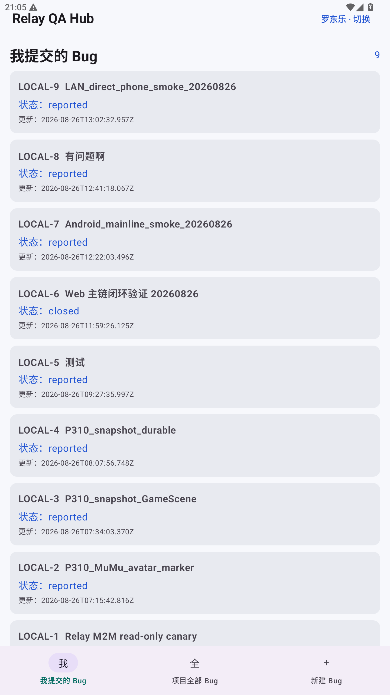

# Relay QA Hub LAN-portable Android + Web evidence — 2026-08-26

## Scope and fixed boundary

- Windows QA Hub host: `10.100.5.157/21` on `vEthernet (CorpAccess)`.
- Directly connected subnet: `10.100.0.0/21`; Windows currently classifies the
  interface as `Public`.
- Management Web: `http://10.100.5.157:4174/`.
- Android QA API: `http://10.100.5.157:4319/api/v1/`.
- Same-phone Unity/Poco: `127.0.0.1:5001`.
- Relay remains server-local at 4317 and is not exposed by the QA Hub LAN rules.
- Unity and Jenkins were not built, started, or changed.

## Implementation

1. API browser authentication accepts a validated list of exact origins through
   `QA_HUB_WEB_ORIGINS`; LAN and loopback origins are allowed, an unlisted origin
   is rejected before session creation.
2. `restart-mvp-api.ps1` and `restart-mvp-web.ps1` auto-detect the active IPv4
   binding, listen on `0.0.0.0`, retain loopback probes, and write only safe LAN
   metadata back to the runtime pointer.
3. `Enable-QAHubLanAccess.ps1` is idempotent and creates two QA-specific inbound
   TCP rules for 4319/4174, with local address `10.100.5.157` and remote subnet
   `10.100.0.0/21`. No QA rule is created for Relay 4317.
4. Android loads `apps/android/config/qa-runtime.json`, seeds it to
   `Android/media/<applicationId>/qa-hub/config/qa-runtime.json`, and prefers the
   external file on later starts. This endpoint is independent from Poco.
5. Every native QA HTTP client uses the same endpoint validator. HTTPS is
   allowed; cleartext is restricted to literal loopback/private/link-local
   addresses and the exact `/api/v1/` base path. Redirects remain disabled.
6. Because direct LAN access is now an Android product feature, the manifest
   declares `ACCESS_LOCAL_NETWORK` and API37 requests it at runtime. API35/36 do
   not request it. API37 runtime behavior remains a release-matrix item.

## Windows runtime verification

- Relay pre-restart gate: health `ok=true`, scheduler active turns `0`, Ops
  sessions `0`, checkpoint maintenance `running=false`, task gate `idle=true`.
- Final listeners:
  - `0.0.0.0:4319`, PID `6192`;
  - `0.0.0.0:4174`, PID `17436`.
- `GET http://10.100.5.157:4319/api/v1/health/ready` returned `ready`.
- `GET http://10.100.5.157:4174/` returned 200.
- A real LAN-origin pinyin login returned 罗东乐, `/auth/me` returned the same
  principal, CSRF-protected logout returned `ok=true`, and origin
  `http://10.100.8.8:4174` returned 403.
- API and Web stderr logs were both zero bytes after restart and verification.
- API targeted tests passed 7/7, including exact multi-origin normalization.
- The QA-specific firewall script was run twice; the second run retained exactly
  two rules, proving idempotence.

This Windows host already had a pre-existing broad Public-profile allow rule for
the bundled `node.exe`. It was preserved because narrowing or deleting that
machine-wide rule could disrupt unrelated Codex/Node work. The QA-specific
rules themselves are subnet-scoped; effective host policy may still be broader
where that existing Node rule applies. The listeners use `0.0.0.0`; the current
advertised host address is the private `10.100.5.157`, and no public Internet
address or port-forward was configured by this work.

## Final Android artifact

```text
path     apps/android/app/build/outputs/apk/debug/app-debug.apk
bytes    33,891,594
sha256   CCC37B9C256554A49152019DFD9D4237E8D90F16E5153FAF3059223DB74897E6
package  com.relayqahub.android.debug
version  0.1.0-debug
minSdk   35 (Android 15)
```

- JVM tests: 45/45 passed.
- Credential-injected `:app:testDebugUnitTest :app:assembleDebug`: successful.
- `apkanalyzer` confirmed the debug package, `ACCESS_LOCAL_NETWORK`,
  `qa-runtime.json`, and `qa-people.json` in the final APK.
- The opaque internal bearer existed only in the Gradle process and its
  environment was cleared after the build. The value was not printed or added
  to source control.

## No-ADB-reverse device proof

Device: MuMu `127.0.0.1:16384`, Android API35.

1. The final APK installed with `adb install -r -t`.
2. Device `base.apk` SHA-256 equaled the built APK SHA above.
3. `adb reverse --list` contained no `tcp:4319` mapping before App launch,
   refresh, or submission.
4. The App-created external runtime file contained exactly:

   ```json
   {
     "schemaVersion": 1,
     "apiBaseUrl": "http://10.100.5.157:4319/api/v1/"
   }
   ```

5. From the Android shell, TCP probes to `10.100.5.157:4319`,
   `10.100.5.157:4174`, and phone-local `127.0.0.1:5001` all returned exit 0.
6. With reverse still absent, the Android App refreshed nine shared Bugs and
   created `LOCAL-9` through the native UI:
   - title `LAN_direct_phone_smoke_20260826`;
   - reporter 罗东乐;
   - fixer 吴鹏生;
   - verifier 王月;
   - state `reported`;
   - Bug ID `241ae185-86ab-4736-bc50-999d65ce4a1e`.
7. API request logs for the native list traffic used host
   `10.100.5.157:4319` and remote address `10.100.5.157`, not loopback. The
   native UI had no network error after submission.
8. `LOCAL-9` bound screenshot capture
   `f7b3fb7c-1d1c-41cd-be16-1b3fb3f8f2a9`. Its durable, previously captured
   same-phone context reported Poco `connectedPort=5001`, `sdkVersion=6`, and
   `enrichmentStatus=partial`; the pending capture and Poco bundle remained
   attachable after the QA API endpoint changed to LAN.

Visible device evidence:



Screenshot SHA-256:
`69C35368541F0F7A670B4803F0D442D9463F04B3DF2F1F2FF71BB5F566C87730`.

## Same-source Web proof

The in-app browser opened `http://10.100.5.157:4174/`, logged in with pinyin,
selected `整个团队` and `全部 Bug`, and read nine items. The first row was
`LOCAL-9`, with 吴鹏生 as fixer and 王月 as verifier. Its detail drawer rendered:

- the exact Android title and description;
- one downloadable screenshot through a LAN-origin blob URL;
- `Unity / Poco 上下文 · partial`;
- the same reporter/fixer/verifier;
- the initial `occurrence.appended` event.

The browser session was explicitly logged out and closed after the check.

## Remaining release tails

- No additional physical Android phone was attached in this run. The APK is
  installable on Android 15+, and MuMu proved the same network topology without
  ADB reverse; a physical-phone overlay/MediaProjection/SELinux/OEM pass remains
  a release gate.
- API37 permission grant/deny behavior is implemented but not runtime-verified.
- If the Windows host IP changes, update `qa-runtime.json`, restart the App, and
  rerun the LAN firewall/API/Web scripts.
- The debug APK contains an internal QA credential and must not leave the
  controlled QA network.
