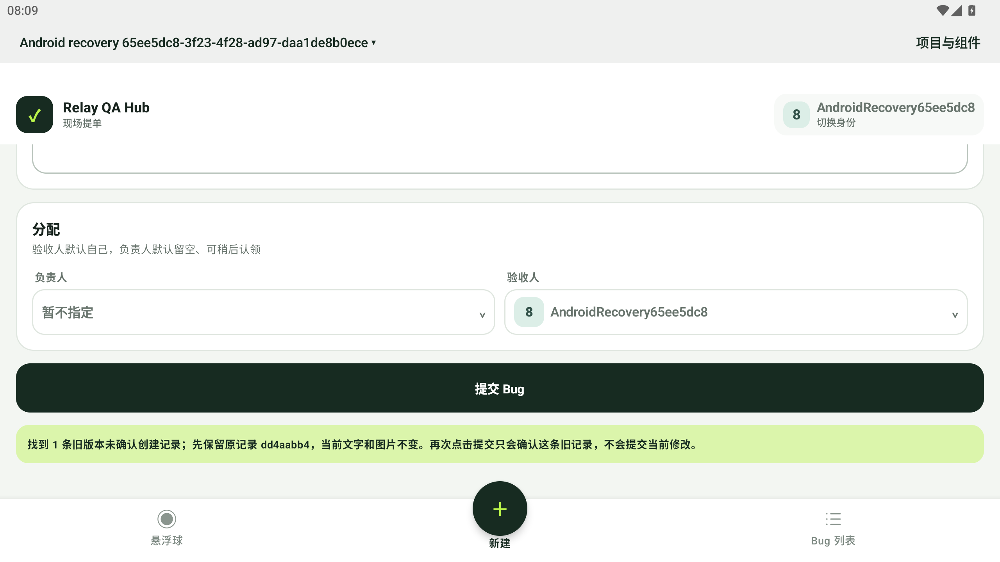
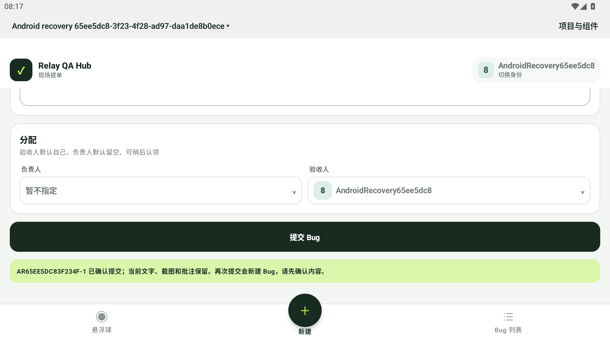
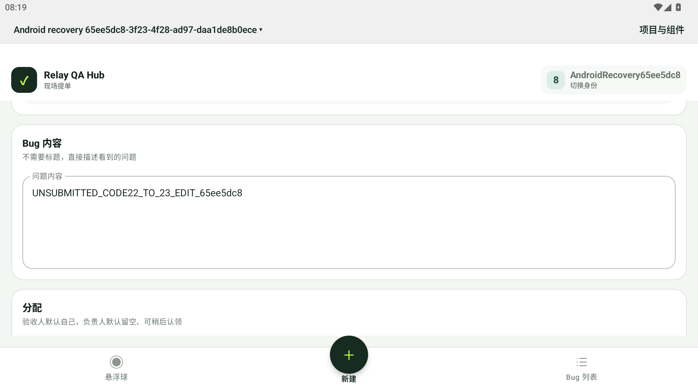
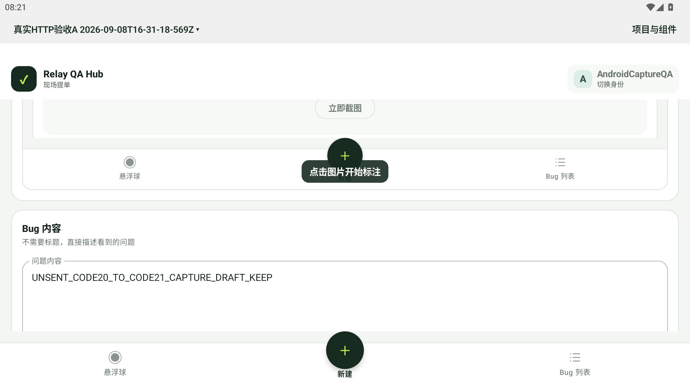

# code22 → code23：真实未确认创建恢复

本轮 MuMu 原生验收通过。code22 在真实 API 已提交后连续四次丢失 201 回执，按约 30、60、120 秒退避耗尽重试。原位升级至 code23 后，第一次点击仅找回原队列记录；第二次点击以原请求和幂等键确认同一 Bug。当前修改稿在确认和重启后保留，没有作为新 Bug 发送。

- [总结果与哈希](result.json)：APK 23 / `0.2.0-preview.9`，SHA256 `9cfa87eb36b5be80f218e104fb4c6338fda3e96e5dcc694d897c5907df768548`。安装前后、首次启动前，12 个私有文件完全一致。
- [独立审计](../../android-recovery-proxy-audits/65ee5dc8-first/README.md)：代理 55/55、官方 API 19/19。服务端始终只有一条 Bug、一条 occurrence 和一个事件；原生身份及原正文一致。
- 本地冷归档只读核对：原 operation ID、完整 scope、payload 与 key 保留，状态从 `FAILED_PERMANENT / RETRY_EXHAUSTED_NETWORK_IO` 变为 `SUCCEEDED`，新增一份匹配的重放回执；另外两条旧操作及旧回执不变。重试计数在显式恢复后重新计为 1，不将其误报为保留原计数 4。
- 原项目 A 的 `AndroidCaptureQA`、旧未提交文字和截图已切回实际界面核对；原图片及 sidecar SHA 不变。日常 APK 仍 code14 / PID5051，偏好设置和预览 runtime 配置哈希均保持。
- 临时 4559 代理通过停止标记正常退出；设备 4419 已恢复映射到主机 4419。所有归档、原 APK、失败记录和测试项目保留。

首次升级前 harness 因合法附件回执表存在而停止，未执行安装；随后仅修正该断言，从同一份冷归档继续。原失败与原脚本在私有运行目录及公开 harness 摘要中保留。构建时首次签名检查的环境失败也保留在 [准备记录](preparation.json)。准备记录的“未安装”描述的是其生成时刻。

本轮是模拟器上的文字旧记录恢复及 `adb install -r` 原位升级，未验证物理 Android、应用内更新、带图未知回执、错误协议回执或全部基线14/21。代理拒绝的三次可选预览更新 GET 单独记录，不当作更新通道通过。

