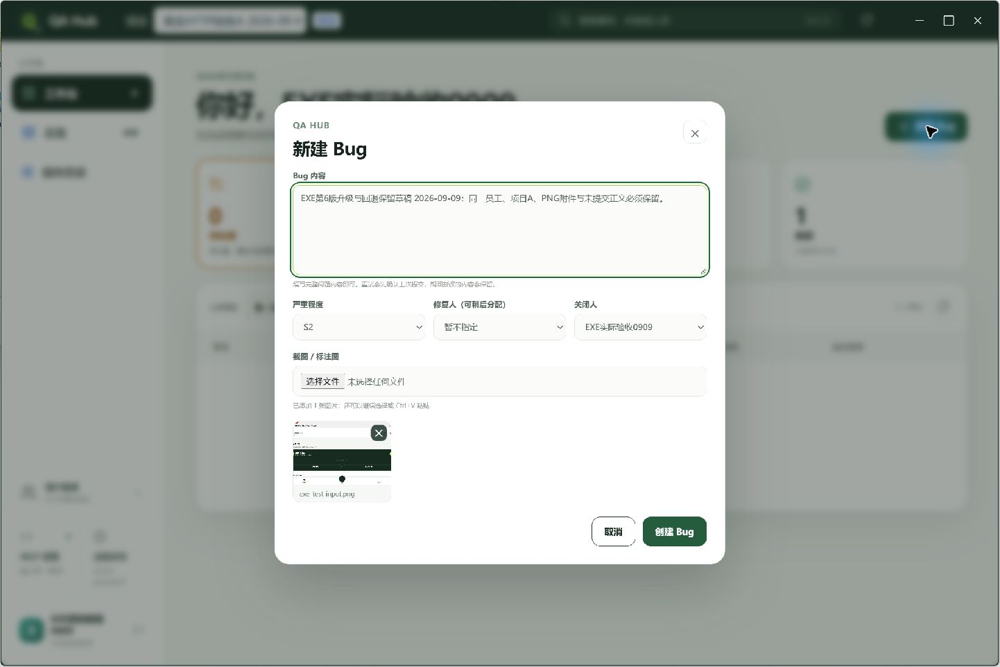
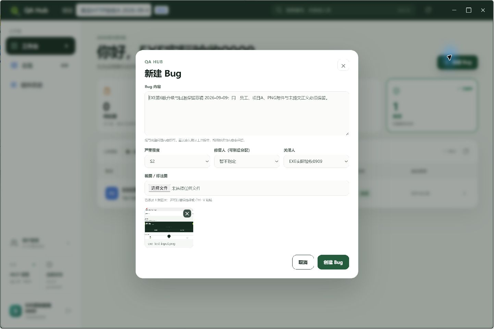

# EXE preview.8 实际应用内升级与原状态保留

已安装预览客户端从 `.7` 通过「当前状态 → 检查更新 → 安装并重启」升级为 `.8`，主 PID 从23924变为19500，4420本地MCP由新进程接管。原员工、项目A、未提交文字和一张 `exe-test-input.png` 保留；原 closed/v14 Bug、绑定图片、20条处理轨迹及既有评论可见。原草稿最终重新打开，未点创建或修改内容。[机器结果及所有原始文件SHA](result.json)。

发布发生于 `2026-09-09T00:40:39.035Z`，原生安装按钮点击于 `00:41:34.563Z`，实际 updater 于 `00:41:50.000Z` 记录 installed。安装器为108333764字节，SHA `b72f04e882873ea0c6f69ccbb09aa7eb612a20343cff0708c0a4816d6dafa147`；release `20260909T000712593Z`，原Ed25519公钥验证的manifest SHA `8345d8cbf7353cde9a6c077224f32886c5b433d2efb4dcd0c39cca86df94e417`。这里只发布独立4274预览通道，旧安装器、旧manifest和回退目录保留。真实 updater 原件是 [UTF-16LE JSON](last-update-result.utf16le.json)，未转码覆盖。

只读 watcher 在实际正常更新退出窗口内观察到预览进程和4420监听均不存在，`00:41:36.938Z–00:41:38.754Z` 完成67文件、11041573字节的私有副本；源/副本/源三份清单相同。**范围排除 profile 顶层 `updates` 目录**，因为安装器正在更新该目录；这不是完整profile冷备份。副本和清单只留在私有runtime，本仓库仅保存 [范围与哈希报告](cold-state-result.json) 和 [实际watcher源码](cold-watch-source.mjs.txt)。没有修改源profile或强制结束客户端。

[独立产物复核](../../exe-preview8-live-proof/artifact-review.json) 54/54通过：实际安装的EXE、updater、asar与本次包字节一致，已安装配置、公钥、manifest和新旧release绑定一致，冷副本67文件逐个重新计算哈希相符。初次仅按BOM选择解码的审查诊断另记；原updater JSON没有BOM，按UTF-16LE解码成功，不构成安装失败。

[独立只读升级前后记录](../../exe-preview8-independent/1786509a-9de7-4d1a-ba8c-9fb282c9c453/README.md) 分别通过51/51、59/59检查，各11个实际只读请求。相同90个local MCP工具、原员工/项目、Bug完整DTO、原评论和绑定PNG字节均保持；六个生产文件哈希、三个生产进程启动时间和预览API/Web/serverMCP启动时间未变。首次采集harness因空StartTime失败且尚未发请求，原失败保留。绑定PNG的SHA不能代替未提交草稿PNG的字节证明，本轮对后者仅有原生可见及私有冷副本证据。

## 本轮发现及尚未覆盖

打开旧Bug的第一份快照出现 [详情读取失败](after-old-bug-first-failure-0.png)，随后仅再次读取窗口便 [正常显示旧详情与图片](after-old-bug-observed-again-0.png)，没有点重试。该现象保留为 `.8` 的未解决界面缺陷，后续共享Web源码修复见 [两行修复及真实App回归](../../web-detail-loading-fix.md)；不能将新的源码测试当作 `.8` 已安装修复，也不据此虚构网络故障。

首次展开历史因控件位于截图外而被工具拒绝，没有产生输入；重新观察并滚动后才点击可见控件。[拒绝原件](history-control-offscreen.json)、[成功展开截图](after-old-bug-history-expanded-0.png)、[完整历史与评论树](after-old-bug-history-observed.json) 均保留。

本次证明实际应用内升级、指定原状态保留及独立通道边界，不覆盖EXE未知提交回执恢复、EXE坏媒体换稿、回退执行、物理Android或全部必测基线。未把Web101/81业务结果移算为EXE实测。

