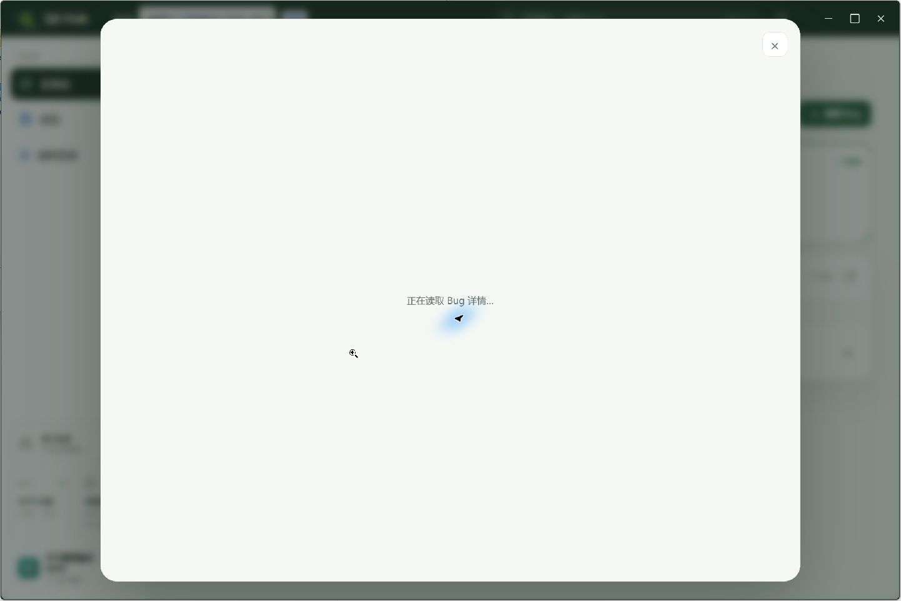
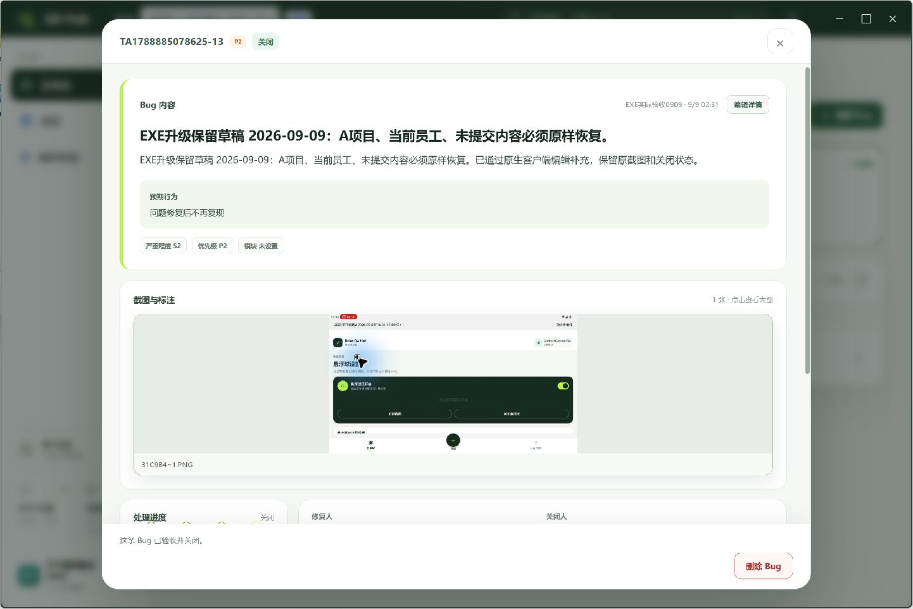
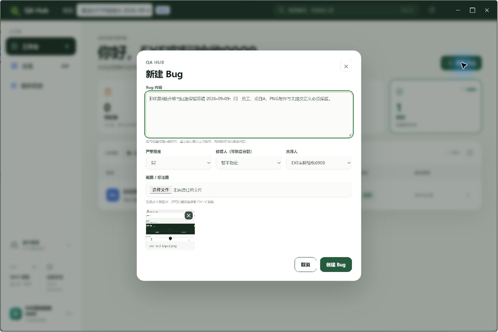

# EXE preview.9 实际应用内升级与原状态保留

Root从已安装的 .8「当前状态→检查更新→安装并重启」实际升级到 .9。发布01:42:31.781Z，点击安装01:43:52.057Z，UTF-16LE updater原件记录01:44:08.000Z installed；主PID19500→13564，文件版本0.2.0.9。release `20260909T011704801Z`，安装器108,334,255字节，SHA `2c50fe1bf5d0f37cdf91c0e0ea449aab6b644f44669fd26a794647d990ad4336`。原sourceCommit为bc2b347、sourceDirty=true，未改写打包来源。[结果及35份原字节清单](result.json)。

原员工/项目A、未提交原文及一张 `exe-test-input.png` 在升级前、升级后settled与最后重新打开时可见。原closed/v14 Bug、绑定PNG、原评论、界面20条处理记录保持；领域event列表实际21条，不混称。独立[升级前53/53](../../exe-preview9-independent/f222d18f-4176-401f-9bdc-af6da4917991/before/proof.json)与[升级后62/62](../../exe-preview9-independent/f222d18f-4176-401f-9bdc-af6da4917991/after/proof.json)各11次只读请求，90个local MCP工具、原会话/完整Bug DTO/评论和184,872字节绑定PNG SHA一致。这个绑定图片SHA不能替代未提交草稿图片的单图SHA。

本次首次点击详情的[树与截图](first-detail-after-click.json)都显示「正在读取 Bug 详情…」，后续[正常显示原Bug与PNG](first-detail-loaded.json)，Root没有点击重试。它仅证明这两个原生观察点，不证明连续所有帧或真实网络故障重试。[.8首次误报历史](../../exe-preview8-live/1786509a-9de7-4d1a-ba8c-9fb282c9c453/result.json)保持原样。

两处树与截图非同时帧已完整保留：`check-update-click`树仍“已是最新版本/检查更新”，图为 .9 下载23%；`after-original-draft`树已含原稿而首图仍为工作台。后续 `after-original-draft-settled` 的树与图均显示草稿，正文以该稳定观察和final为依据，不抹去先前帧。

[冷副本结果](cold-state-result.json)记录01:43:55.136Z–01:43:56.777Z退出窗口内复制67文件、11,579,757字节，**排除profile顶层updates目录，并非完整profile备份**。[独立产物复核114/114](../../exe-preview9-live-proof/artifact-review.json)核对实际安装/包/新旧release、配置/Ed25519公钥及67副本哈希；本汇集没有读取其它活profile内容。

生产六文件与三个原进程、预览API/Web/serverMCP保持的结论只对应独立前后观察时段；两生产Node不可见path仍保留null。本次汇集只读已冻结原件、create-only复制，无新增UI/HTTP/设备/服务操作；35份复制字节一致，通用敏感信息扫描0命中。未将本次升级算作EXE未知回执/坏媒体新建、回退、物理Android或全部基线通过。

