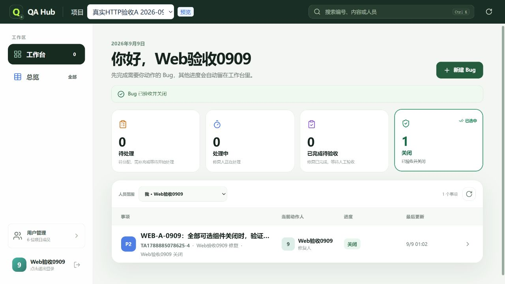
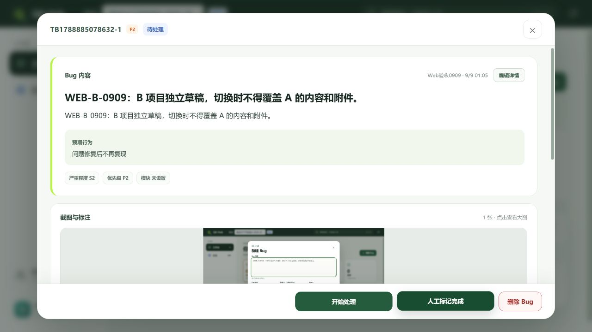

# Web 真实浏览验收（独立预览子集）

记录生成：2026-09-08T17:10:16.334Z。Web 4274，API 4419，测试员工 Web验收0909。

## 实际结果

| 检查 | 状态 | 证据与边界 |
|---|---|---|
| project_entry | passed | 真实浏览器从项目A入口以Web验收0909首次姓名登录；当时选择器仅A。 [证据](02-project-a-restored.txt) |
| multi_project | passed | 同名登录B登记第二个项目，选择器A/B；两者保持同一稳定userId。 [证据](07-project-b-draft.txt) |
| draft_scope | passed | A内容/修复人/关闭人/1个File切到B不显示；B另写草稿后切A原样恢复。 [证据](02-project-a-restored.txt) |
| draft_reload | passed | 完整页面reload后，A内容/两个人员选择和File仍在IndexedDB恢复；B也在reload后保留。 [证据](03-reload-restored.txt) |
| base_lifecycle | passed | 五组件均disabled时A Bug创建→评论→开始处理→人工完成→验收退回→再次人工完成→关闭；最终closed/v13。 [证据](06-manual-closed.txt) |
| attachment | passed | 正确JPEG在B上传、绑定、读取回显；独立HTTP下载43311字节与本地文件逐字节相同。 [证据](08-jpeg-upload-readback.txt) |
| comments | passed | B评论正文提交后可见，reload后仍读回；A评论也由真实HTTP读回。 [证据](09-comment-reloaded.txt) |
| login_url | passed | 修复登录框改变项目但URL保留旧值的问题；B地址下改填A登录后URL和选择器均A。 [证据](10-login-project-url-fixed.txt) |
| late_responses | unit_passed_not_full_e2e | 四项专项回归证明请求头冻结、响应体迟到拒绝、GM指定路径及服务/项目/用户键隔离；真实浏览未注入网络延迟。 [证据](../coverage-matrix.json) |
| multi_window | passed | 两个标签A/B并行；A撤权后可导出草稿，B仍创建成功，A恢复后草稿与文件恢复。[证据](dual-window-results.json) |
| gm_ui | not_run | GM界面已实现和构建；本轮浏览只测普通员工。 |
| external_components | not_run | 本轮所有可选组件disabled；未运行Jenkins、上传外部发布、Relay或第三方同步完整链路。 |

A Bug：`5128877f-21c5-4889-9dd0-15134e24b291`，`TA1788885078625-4`，最终 `closed` / version 13。
B Bug：`434a4f1f-0144-4f96-9125-47d85fcfba8c`，`TB1788885078632-1`，`reported` / version 1，用于附件与草稿验收，保留供后续测试。

[服务器读回](http-readback.json)确认两项目全部五组件均停用；JPEG SHA-256 `cd6990dd7224ad2d1f7ec6d79891afba350bb2d87d633fa8b6c79457678c4c88`、43311字节，与本地一致。

## 测试输入纠正

初次截图工具返回JPEG/JFIF字节，被测试执行者误存为`.png`并声明`image/png`，finalize正确拒绝`SQLITE_UPLOAD_INVALID`。原错误文件和失败截图保留；同字节按`.jpg`声明正确类型后通过。此项不记为项目隔离缺陷。部分早期截图文件扩展名为`.png`但实际为JPEG，results.json记录真实媒体类型。

浏览发现并修复登录框改变项目后URL仍保留旧项目、处理记录只显示事件类型而不显示评论正文两个问题，修复后已实际重测。

本轮最终类型检查、ESLint通过，13文件59项Vitest通过，Web构建成功。代码和单元测试不替代GM、成员、并行多窗口、APK/EXE/MCP及外部组件端到端验收；覆盖矩阵仍保留未执行状态，后续按证据细化。

双标签及撤权草稿恢复新增证据：[详细结果](dual-window-results.md)。
